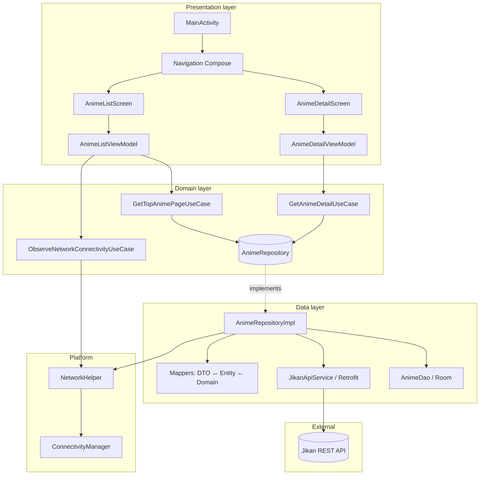

# Anime App (MVVM)

Android app that browses top-rated anime from the [Jikan API](https://docs.api.jikan.moe/), with detail pages, trailers, Room caching, offline support, and infinite-scroll pagination. Built with **Jetpack Compose**, **MVVM**, and a small **clean-architecture** style split between UI, domain, and data layers.

---

## Functionality

| Area | Behavior |
|------|----------|
| **Anime list** | Loads top anime (`GET /v4/top/anime?page=…`). Cards show title, episodes, MAL score, poster, rank, type, and status. **Infinite scroll** loads the next page as you approach the bottom. |
| **Anime detail** | Opens from a list item (`GET /v4/anime/{id}`). Shows trailer (opens YouTube or browser), English/Japanese titles, expandable synopsis, genres, episodes, rating, and status. |
| **Caching** | Responses are mapped to **Room** entities and stored with page numbers for paginated reads. |
| **Offline** | When offline (or on API failure), the app serves **cached** list/detail data when available. Connectivity is observed via **Flow**; coming back online can trigger recovery from error states. |
| **Errors** | Failures surface as UI error states with **retry**; pagination can show a bottom retry without breaking the list. |
| **Images toggle** | **BuildConfig** can default image loading off; the list screen also offers a **runtime toggle** so posters can be hidden app-wide (list + detail) without breaking layout. |

---

## High-level design (HLD)

**Data flow (simplified):** Screens collect **StateFlow** / **UiState** from ViewModels. ViewModels call **use cases**, which delegate to **`AnimeRepository`**. The implementation talks to **Retrofit** when online, persists through **Room**, and falls back to the database when offline or on errors. DTOs never leak into the UI—everything is mapped to **domain models** first.

---

## Concepts used

- **MVVM** — UI state and events in ViewModels; Compose observes state lifecycle-aware (`collectAsStateWithLifecycle` where applicable).
- **Layered architecture** — **UI** → **domain** (use cases + interfaces + models) → **data** (repository implementation, API, Room, mappers).
- **Repository pattern** — Single abstraction (`AnimeRepository`) for list/detail; implementation chooses network vs cache.
- **Use cases** — Thin orchestration (`GetTopAnimePageUseCase`, `GetAnimeDetailUseCase`, `ObserveNetworkConnectivityUseCase`).
- **Unidirectional data flow** — User events → ViewModel → use case → repository → Flow/Result → UI state.
- **Offline-first behavior** — Network-first when connected; Room as source of truth for previously fetched pages and details.
- **Pagination** — Page-based API + local queries “up to page”; scroll-triggered loading with debouncing / distinct emissions to avoid duplicate loads.
- **Sealed types** — e.g. `UiState`, `TrailerAction` for exhaustive handling in UI or mapping.
- **Manual dependency injection** — `AppContainer` wires Retrofit, Room, repository, and use cases (no Hilt/Dagger in this project).

---

## Tech stack

| Category | Libraries / APIs |
|----------|------------------|
| UI | Jetpack Compose, Material 3, Navigation Compose |
| Async | Kotlin Coroutines, StateFlow, Flow |
| Networking | Retrofit, OkHttp, Gson |
| Persistence | Room |
| Images | Coil |
| API | Jikan v4 — `https://api.jikan.moe/v4/` (no API key) |

**Endpoints used**

- `GET /v4/top/anime?page={n}` — paginated top anime  
- `GET /v4/anime/{id}` — detail (synopsis, genres, trailer metadata)

---

## Project structure (main modules)

| Path | Role |
|------|------|
| `AnimeApplication.kt` | Application; holds `AppContainer` |
| `di/AppContainer.kt` | Manual DI: Retrofit, Room, repository, use cases |
| `domain/model/` | `Anime`, `PaginatedResult`, trailer-related domain types |
| `domain/repository/AnimeRepository.kt` | Repository contract |
| `domain/usecase/` | Get top page, get detail, observe connectivity |
| `data/api/JikanApiService.kt` | Retrofit API |
| `data/local/` | `AnimeDatabase`, `AnimeDao`, `AnimeEntity` |
| `data/model/` | DTOs, mappers |
| `data/repository/AnimeRepositoryImpl.kt` | Network + Room implementation |
| `ui/animelist/`, `ui/animedetail/` | Screens + ViewModels |
| `ui/navigation/AppNavigation.kt` | Nav graph, shared image-toggle state |
| `utils/NetworkHelper.kt`, `utils/UiState.kt` | Connectivity, shared UI state shape |

---

## Build and run

1. Clone the repository and open it in **Android Studio** (recent stable version).
2. Sync Gradle and run the `app` configuration on an emulator or device (**minSdk 24**, **compileSdk / targetSdk 36**). Use **JDK 17** and a recent **Android Studio** build that supports **AGP 9.x** (built-in Kotlin).

No API key is required.

---

## Known limitations

- Search is not implemented (could use `GET /v4/anime?q=…`).
- Image bytes are not stored in Room; offline posters depend on Coil’s cache where applicable.
- Heavy pagination may hit Jikan rate limits; the UI supports retry.
